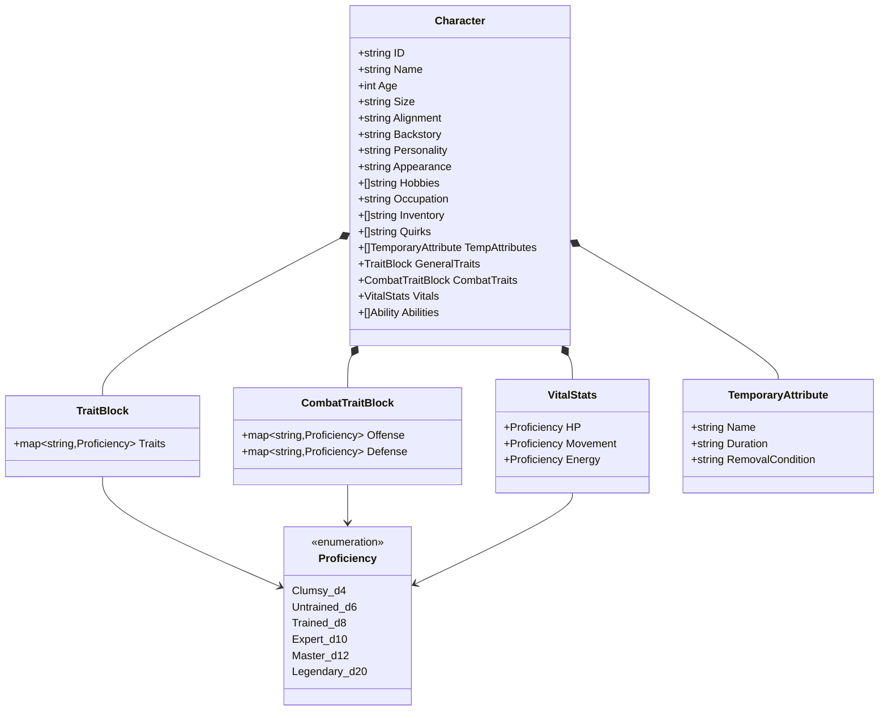
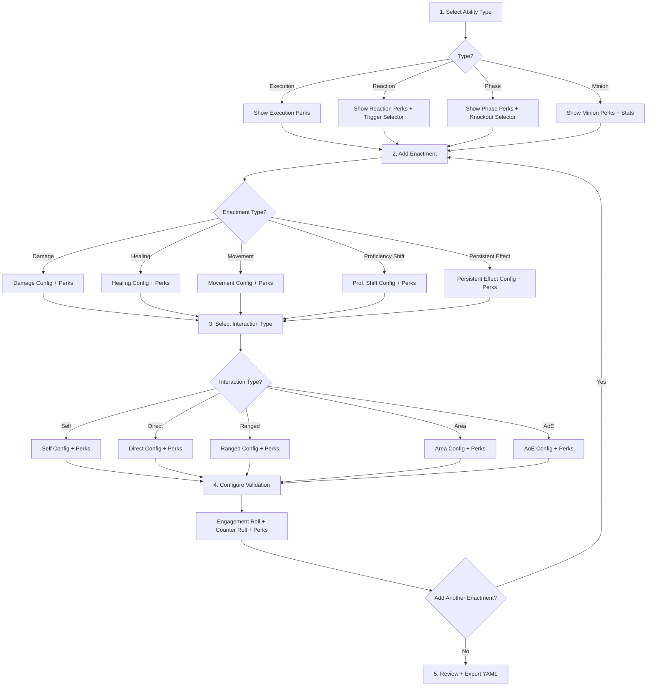
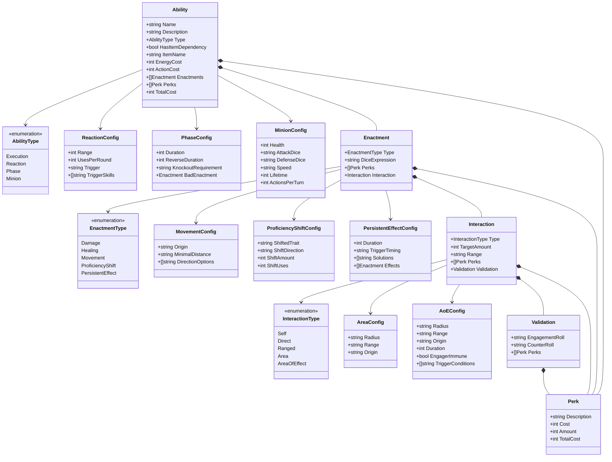
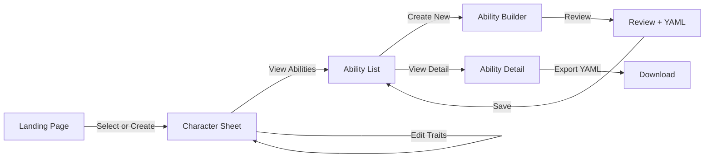

# Ability Builder Web Application — Architecture Plan

## Overview

A Go web application that provides a form-based UI for building TTRPG abilities using cascading dropdowns, managing character sheets, and browsing created abilities. The app uses Go's `html/template` package for server-side rendering and [HTMX](https://htmx.org) for dynamic partial page updates without a full JavaScript framework. The result is a lightweight, fast, and maintainable webapp.

### Core Features

1. **Character Sheet** — Define a character with traits at specific proficiency levels. The ability builder references this character's actual trait dice when constructing abilities.
2. **Ability Builder** — Cascading dropdown form to construct abilities from modular components.
3. **Ability List** — Browse, view, and manage all created abilities for a character.

---

## Technology Stack

| Layer | Technology | Rationale |
|-------|-----------|-----------|
| Backend | Go (stdlib `net/http`) | Simple, fast, single binary deployment |
| Templating | `html/template` | Native Go, composable partials |
| Dynamic UI | HTMX | Cascading dropdowns via HTML attributes, no JS framework needed |
| Styling | Tailwind CSS (CDN) | Rapid prototyping, utility-first |
| Data | In-memory structs + JSON file persistence | Simple file-based storage; no DB needed for a builder tool |
| Output | YAML export | Matches the existing doc format for abilities |

---

## Character Sheet

The character sheet is the foundation that the ability builder references. When building abilities, trait dropdowns are populated from the character's actual trait proficiencies, and dice expressions reflect the character's real dice tiers.

### Character Data Model



### General Traits

These are the default general traits. The world setting may modify this list.

| Trait | Default Proficiency |
|-------|-------------------|
| Strength | Untrained |
| Dexterity | Untrained |
| Stealth | Untrained |
| Perception | Untrained |
| Nature | Untrained |
| Crafting | Untrained |
| People Skill | Untrained |
| Performance | Untrained |
| Thievery | Untrained |
| Knowledge | Untrained |
| Magic | Untrained |

### Combative Traits

| Category | Trait | Default Proficiency |
|----------|-------|-------------------|
| **Offense** | Precision | Untrained |
| **Offense** | Power | Untrained |
| **Offense** | Mind | Untrained |
| **Offense** | Magic | Untrained |
| **Defense** | Reflex | Untrained |
| **Defense** | Constitution | Untrained |
| **Defense** | Mind | Untrained |
| **Defense** | Magic | Untrained |

### Vital Stats

| Stat | Proficiency Levels |
|------|-------------------|
| HP | 8 / 12 / 16 / 20 / 24 / 28 |
| Movement | 3 / 4 / 5 / 6 / 7 / 8 meters |
| Energy | 3 / 4 / 5 / 6 / 7 / 8 |

### Character Sheet UI

The character sheet page allows creating and editing characters. When a character is selected, the ability builder uses their trait proficiencies to:
- Populate engagement roll and counter roll dropdowns with the character's actual dice
- Show the effective dice tier next to trait names
- Calculate energy costs against the character's energy pool

```
┌─────────────────────────────────────────────────────────┐
│  Blok2 TTRPG — Character Sheet                          │
├─────────────────────────────────────────────────────────┤
│                                                         │
│  Name: [Michael          ]  Age: [2 months]             │
│  Size: [1.2m]  Alignment: [Rebel Chaotic]               │
│  Backstory: [Forced to work for the Ylten Guild    ]    │
│  Personality: [Overly Positive and Impulsive       ]    │
│  Appearance: [Wooden Puppet                        ]    │
│                                                         │
│  ── General Traits ─────────────────────────────────    │
│  Strength:     [▼ Untrained (d6) ]                      │
│  Dexterity:    [▼ Trained (d8)   ]                      │
│  Stealth:      [▼ Untrained (d6) ]                      │
│  Perception:   [▼ Expert (d10)   ]                      │
│  Nature:       [▼ Clumsy (d4)    ]                      │
│  Crafting:     [▼ Expert (d10)   ]                      │
│  People Skill: [▼ Trained (d8)   ]                      │
│  Performance:  [▼ Untrained (d6) ]                      │
│  Thievery:     [▼ Untrained (d6) ]                      │
│  Knowledge:    [▼ Master (d12)   ]                      │
│  Magic:        [▼ Clumsy (d4)    ]                      │
│                                                         │
│  ── Combative Traits ───────────────────────────────    │
│  Offense:                                               │
│    Precision:    [▼ Trained (d8)   ]                    │
│    Power:        [▼ Expert (d10)   ]                    │
│    Mind:         [▼ Untrained (d6) ]                    │
│    Magic:        [▼ Clumsy (d4)    ]                    │
│  Defense:                                               │
│    Reflex:       [▼ Trained (d8)   ]                    │
│    Constitution: [▼ Expert (d10)   ]                    │
│    Mind:         [▼ Untrained (d6) ]                    │
│    Magic:        [▼ Clumsy (d4)    ]                    │
│                                                         │
│  ── Vitals ─────────────────────────────────────────    │
│  HP:       [▼ Trained (16) ]                            │
│  Movement: [▼ Trained (5m) ]                            │
│  Energy:   [▼ Trained (5)  ]                            │
│                                                         │
│  Trait Points Used: 14 / 8  [!Over budget]              │
│                                                         │
│  [Save Character]                                       │
└─────────────────────────────────────────────────────────┘
```

---

## Ability List

The ability list page shows all abilities created for the currently selected character. It provides a quick overview with key stats and allows navigation to view details or edit.

```
┌─────────────────────────────────────────────────────────┐
│  Blok2 TTRPG — Abilities for: Michael                   │
├─────────────────────────────────────────────────────────┤
│                                                         │
│  Character: [▼ Michael       ]  [+ New Character]       │
│                                                         │
│  [+ Create New Ability]                                 │
│                                                         │
│  ┌─────────────────────────────────────────────────┐    │
│  │ ⚔ Vampiric Strike          Type: Execution      │    │
│  │ Energy: 3  Actions: 2  Cost: 12                 │    │
│  │ Enactments: Damage → Healing                    │    │
│  │ [View YAML]  [Edit]  [Delete]                   │    │
│  └─────────────────────────────────────────────────┘    │
│                                                         │
│  ┌─────────────────────────────────────────────────┐    │
│  │ 🛡 Reactive Heal             Type: Reaction      │    │
│  │ Energy: 3  Trigger: Someone runs towards you    │    │
│  │ Cost: 19                                        │    │
│  │ Enactments: Healing                             │    │
│  │ [View YAML]  [Edit]  [Delete]                   │    │
│  └─────────────────────────────────────────────────┘    │
│                                                         │
│  ┌─────────────────────────────────────────────────┐    │
│  │ 🔥 Rage Phase               Type: Phase          │    │
│  │ Energy: 3  Duration: 3 rounds  Cost: 8          │    │
│  │ Enactments: Proficiency Shift                   │    │
│  │ [View YAML]  [Edit]  [Delete]                   │    │
│  └─────────────────────────────────────────────────┘    │
│                                                         │
└─────────────────────────────────────────────────────────┘
```

---

## Cascading Dropdown Flow

The core UX is a multi-step form where each selection reveals the next set of options. HTMX handles this by swapping HTML fragments returned from the server.



---

## Data Model

The Go structs mirror the TTRPG document structure exactly. This makes it straightforward to serialize to YAML for export.



---

## Reference Data

These are the static lookup tables derived from the docs, used to populate dropdowns.

### Traits

| Category | Traits |
|----------|--------|
| **Offensive** | Precision, Power, Mind, Magic |
| **Defensive** | Reflex, Constitution, Mind, Magic |
| **General** | Strength, Dexterity, Stealth, Perception, Nature, Crafting, People Skill, Performance, Thievery, Knowledge, Magic |

### Dice Tiers

| Tier | Die | Proficiency |
|------|-----|-------------|
| 1 | d4 | Clumsy |
| 2 | d6 | Untrained |
| 3 | d8 | Trained |
| 4 | d10 | Expert |
| 5 | d12 | Master |
| 6 | d20 | Legendary |

### Reaction Triggers

| Trigger |
|---------|
| Someone runs away from you |
| Someone runs towards you |
| Someone has to do a Defense roll |
| Someone takes damage |
| Someone gets healed |
| Someone gets an adjustment |
| Someone does a skill check |
| Someone summons a minion |
| Someone grabs your character |
| You walk towards someone |
| You walk away from someone |

### Phase Knockout Requirements

| Requirement |
|-------------|
| You take damage |
| You die |
| *(extensible — TBD with GM)* |

---

## HTMX Interaction Pattern

The cascading dropdown pattern works as follows:

1. User selects a value in dropdown A
2. HTMX fires a `GET` request to the server with the selected value
3. Server returns an HTML fragment for the next section
4. HTMX swaps the fragment into the target `div`

```html
<!-- Example: Ability Type selector triggers loading of type-specific config -->
<select name="ability_type"
        hx-get="/partials/ability-type-config"
        hx-target="#ability-type-config"
        hx-trigger="change"
        hx-include="this">
    <option value="">-- Select Ability Type --</option>
    <option value="execution">Execution</option>
    <option value="reaction">Reaction</option>
    <option value="phase">Phase</option>
    <option value="minion">Minion</option>
</select>

<div id="ability-type-config">
    <!-- HTMX will swap content here based on selection -->
</div>
```

Each subsequent dropdown follows the same pattern, creating a chain of dependent selections.

---

## Project Structure

```
ability-builder/
├── main.go                     # Entry point, router setup
├── go.mod                      # Go module definition
├── go.sum
│
├── internal/
│   ├── handlers/
│   │   ├── handlers.go         # Shared handler utilities, template rendering
│   │   ├── character.go        # Character sheet CRUD handlers
│   │   ├── ability.go          # Ability builder handlers: type selection, perks
│   │   ├── ability_list.go     # Ability list, detail view, delete handlers
│   │   ├── enactment.go        # Enactment handlers: type config, perks
│   │   ├── interaction.go      # Interaction handlers: type config, perks
│   │   └── validation.go       # Validation handlers: rolls, perks
│   │
│   ├── models/
│   │   ├── character.go        # Character, TraitBlock, VitalStats, Proficiency
│   │   ├── ability.go          # Ability, AbilityType, Perk structs
│   │   ├── enactment.go        # Enactment types and configs
│   │   ├── interaction.go      # Interaction types and configs
│   │   ├── validation.go       # Validation struct
│   │   └── reference.go        # Static reference data: traits, dice, triggers
│   │
│   ├── storage/
│   │   └── storage.go          # JSON file-based persistence for characters + abilities
│   │
│   ├── session/
│   │   └── session.go          # In-memory session store for builder state
│   │
│   └── export/
│       └── yaml.go             # YAML export logic
│
├── templates/
│   ├── layout.html             # Base layout with head, nav, footer
│   ├── index.html              # Landing page / character selector
│   ├── character.html          # Character sheet form: create + edit
│   ├── abilities.html          # Ability list for a character
│   ├── builder.html            # Ability builder form
│   ├── review.html             # Ability review and YAML output page
│   │
│   └── partials/
│       ├── nav.html                      # Navigation bar partial
│       ├── character_traits.html         # General trait proficiency dropdowns
│       ├── character_combat_traits.html  # Combat trait proficiency dropdowns
│       ├── character_vitals.html         # Vital stats dropdowns
│       ├── ability_card.html             # Single ability card for the list
│       ├── ability_type_config.html      # Type-specific config: execution, reaction, phase, minion
│       ├── ability_perks.html            # Ability-level perk selector
│       ├── enactment_form.html           # Enactment type selector + config
│       ├── enactment_damage.html         # Damage enactment fields
│       ├── enactment_healing.html        # Healing enactment fields
│       ├── enactment_movement.html       # Movement enactment fields
│       ├── enactment_profshift.html      # Proficiency Shift enactment fields
│       ├── enactment_persistent.html     # Persistent Effect enactment fields
│       ├── enactment_perks.html          # Enactment-level perk selector
│       ├── interaction_form.html         # Interaction type selector + config
│       ├── interaction_self.html         # Self interaction fields
│       ├── interaction_direct.html       # Direct interaction fields
│       ├── interaction_ranged.html       # Ranged interaction fields
│       ├── interaction_area.html         # Area interaction fields
│       ├── interaction_aoe.html          # AoE interaction fields
│       ├── interaction_perks.html        # Interaction-level perk selector
│       ├── validation_form.html          # Validation config: rolls + perks
│       ├── perk_row.html                 # Reusable perk row component
│       └── enactment_list.html           # List of added enactments with add button
│
├── data/                                 # JSON persistence directory
│   └── .gitkeep
│
└── static/
    └── css/
        └── custom.css                    # Any custom styles beyond Tailwind
```

---

## Route Map

### Character Routes

| Method | Path | Handler | Returns |
|--------|------|---------|---------|
| `GET` | `/` | `IndexHandler` | Full page: character selector / landing |
| `GET` | `/characters/new` | `NewCharacterHandler` | Full page: empty character sheet form |
| `POST` | `/characters` | `CreateCharacterHandler` | Redirect to character sheet |
| `GET` | `/characters/{id}` | `ViewCharacterHandler` | Full page: character sheet |
| `POST` | `/characters/{id}` | `UpdateCharacterHandler` | Redirect to character sheet |
| `DELETE` | `/characters/{id}` | `DeleteCharacterHandler` | Redirect to `/` |

### Ability List Routes

| Method | Path | Handler | Returns |
|--------|------|---------|---------|
| `GET` | `/characters/{id}/abilities` | `AbilityListHandler` | Full page: ability list for character |
| `GET` | `/characters/{id}/abilities/{aid}` | `AbilityDetailHandler` | Full page: ability detail + YAML |
| `DELETE` | `/characters/{id}/abilities/{aid}` | `DeleteAbilityHandler` | HTMX swap: remove card from list |
| `GET` | `/characters/{id}/abilities/{aid}/export` | `ExportAbilityYAMLHandler` | YAML file download |

### Ability Builder Routes

| Method | Path | Handler | Returns |
|--------|------|---------|---------|
| `GET` | `/characters/{id}/abilities/new` | `BuilderHandler` | Full page: ability builder form |
| `GET` | `/partials/ability-type-config` | `AbilityTypeConfigHandler` | HTML fragment: type-specific fields |
| `GET` | `/partials/ability-perks` | `AbilityPerksHandler` | HTML fragment: ability-level perks |
| `POST` | `/partials/enactment` | `AddEnactmentHandler` | HTML fragment: new enactment form |
| `GET` | `/partials/enactment-config` | `EnactmentConfigHandler` | HTML fragment: enactment-type fields |
| `GET` | `/partials/enactment-perks` | `EnactmentPerksHandler` | HTML fragment: enactment perks |
| `GET` | `/partials/interaction-config` | `InteractionConfigHandler` | HTML fragment: interaction-type fields |
| `GET` | `/partials/interaction-perks` | `InteractionPerksHandler` | HTML fragment: interaction perks |
| `GET` | `/partials/validation-config` | `ValidationConfigHandler` | HTML fragment: validation fields |
| `GET` | `/partials/validation-perks` | `ValidationPerksHandler` | HTML fragment: validation perks |
| `POST` | `/ability/save` | `SaveAbilityHandler` | Saves ability to character, redirects to list |
| `GET` | `/ability/review` | `ReviewHandler` | Full page: review + YAML output |
| `POST` | `/ability/reset` | `ResetHandler` | Clears builder session, redirects |

---

## Navigation Flow



---

## Persistence

Data is persisted as JSON files in the `data/` directory:

- `data/characters.json` — array of all characters with their trait configurations
- Each character has an `abilities` array embedded within it

This keeps things simple — no database, no migrations. The storage layer provides `Load()` and `Save()` functions that read/write the entire file. For a single-user builder tool, this is sufficient.

### Session Management

The in-memory session store is used only for the **ability builder form state** — tracking the work-in-progress ability as the user progresses through cascading dropdowns. Once the ability is saved, it moves from session to persistent storage.

- **In-memory map** keyed by a cookie-based session ID
- Each session holds the current `Ability` being built + the active character ID
- State is updated incrementally as the user progresses through the form
- On save or reset, the session is cleared

---

## Cost Calculation

The total ability cost is computed server-side by summing:

1. **Ability-level perk costs** — from the ability type perks
2. **Enactment costs** — base cost per enactment type + enactment perks
3. **Interaction costs** — interaction perks
4. **Validation costs** — validation perks

The running total is displayed in a sticky sidebar/header that updates via HTMX after each form change.

---

## UI Wireframe

```
┌─────────────────────────────────────────────────────────┐
│  Blok2 TTRPG — Ability Builder            [Total: 12]   │
├─────────────────────────────────────────────────────────┤
│                                                         │
│  Ability Name: [________________________]               │
│  Description:  [________________________]               │
│                                                         │
│  Ability Type: [▼ Execution          ]                  │
│  ┌─────────────────────────────────────────────┐        │
│  │  Energy Cost: [3]  Action Cost: [2]         │        │
│  │  Item Dependency: [ ] ___________           │        │
│  │                                             │        │
│  │  Perks:                                     │        │
│  │  [▼ Select Perk] [Amount: 1] [+ Add]        │        │
│  │  • Reduce Energy cost by 1    x1  = 1       │        │
│  └─────────────────────────────────────────────┘        │
│                                                         │
│  ── Enactment 1 ──────────────────────────────          │
│  Type: [▼ Enact Damage       ]                          │
│  ┌─────────────────────────────────────────────┐        │
│  │  Damage Dice: [1d4] (base)                  │        │
│  │                                             │        │
│  │  Perks:                                     │        │
│  │  [▼ Select Perk] [Amount: 1] [+ Add]        │        │
│  │  • Shift Dice Tier up         x2  = 4       │        │
│  │  • Add Offensive Trait Dice   x1  = 3       │        │
│  │                                             │        │
│  │  Interaction: [▼ Ranged           ]         │        │
│  │  ┌──────────────────────────────────┐       │        │
│  │  │  Range: [10m]  Targets: [1]      │       │        │
│  │  │  Visible: [✓]  Obstructed: [ ]   │       │        │
│  │  │                                  │       │        │
│  │  │  Validation:                     │       │        │
│  │  │  Engagement: [▼ Power    ] -2    │       │        │
│  │  │  Counter:    [▼ Reflex   ]       │       │        │
│  │  │         or   [▼ Constit. ]       │       │        │
│  │  └──────────────────────────────────┘       │        │
│  └─────────────────────────────────────────────┘        │
│                                                         │
│  [+ Add Enactment]                                      │
│                                                         │
│  [Review & Export]                [Reset]                │
└─────────────────────────────────────────────────────────┘
```

---

## Implementation Todo List

These are the steps to implement the skeleton, in order:

### Phase 1: Foundation
1. Initialize Go module and project directory structure
2. Define character model structs in `internal/models/character.go`
3. Define ability model structs in `internal/models/ability.go`, `enactment.go`, `interaction.go`, `validation.go`
4. Define reference data — traits, dice tiers, triggers, perks per type — in `internal/models/reference.go`
5. Create the JSON file storage layer in `internal/storage/storage.go`
6. Create the session store in `internal/session/session.go`

### Phase 2: Character Sheet
7. Build the base HTML layout template with Tailwind CDN, HTMX CDN, and navigation
8. Create the landing page with character selector
9. Create the character sheet form template with trait proficiency dropdowns
10. Implement character CRUD handlers — create, view, update, delete

### Phase 3: Ability Builder
11. Create the ability builder form template with initial ability type dropdown
12. Implement the ability type config partial handler and template
13. Implement the enactment form partial handler and templates for each enactment type
14. Implement the interaction form partial handler and templates for each interaction type
15. Implement the validation form partial handler and template
16. Implement perk selector components — reusable partial
17. Implement the review page with YAML preview

### Phase 4: Ability List + Export
18. Create the ability list page template with ability cards
19. Implement ability list and detail view handlers
20. Implement YAML export handler
21. Implement ability delete handler

### Phase 5: Wiring + Polish
22. Wire up all routes in `main.go`
23. Add running cost calculation that updates via HTMX
24. Test the full flow: create character → build ability → review → save → list

---

## Key Design Decisions

| Decision | Rationale |
|----------|-----------|
| **HTMX over SPA framework** | Keeps the stack simple; Go templates + HTMX is a natural fit for cascading forms. No build step, no JS bundling. |
| **stdlib `net/http` over framework** | The routing is simple enough that a framework adds unnecessary complexity. Can upgrade to Chi or Echo later if needed. |
| **JSON file persistence** | Characters and abilities are saved to a JSON file. Simple, no DB setup, easy to inspect and version control. |
| **In-memory session for builder only** | Session state is only used for the work-in-progress ability. Completed abilities are persisted to JSON. |
| **Character-centric data model** | Abilities belong to a character. The builder references the character's actual trait proficiencies for dropdown population. |
| **YAML export** | Matches the existing documentation format exactly, making it easy to copy abilities into character sheets. |
| **Partials-based architecture** | Each dropdown cascade returns a small HTML fragment. This keeps templates small, focused, and independently testable. |
| **Tailwind via CDN** | No build tooling needed. For a skeleton/prototype this is ideal. Can switch to a local build later. |
